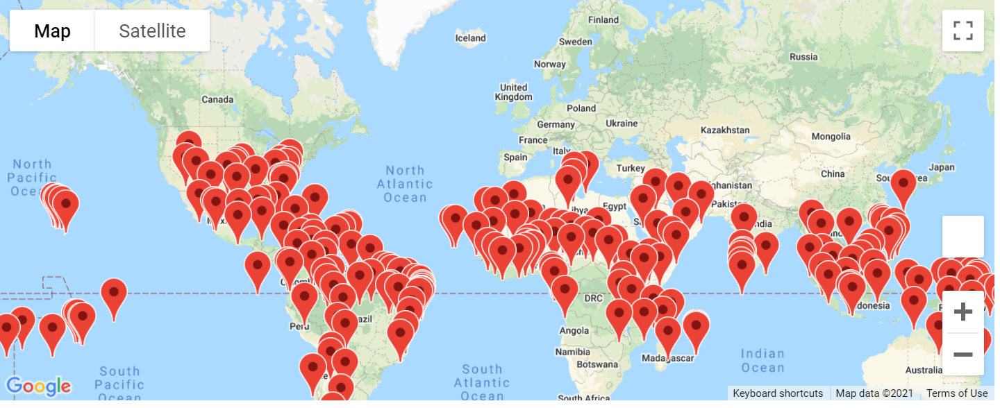

# World_Weather_Analysis

## Actions Taken

### Obtaining Data
First I had to create a dataframe to retrieve the weather data from 2000 latitudes and longitudes that include the weather description, such as scattered clouds. I exported this data to retrieve in the next section.

### Creating Preferred Cities
Using similar codes as used in the module, I created perferred cities based on temperatures the end user would prefer. I used similar range as before, 75-95 degrees Fahrenheit. Then I planted markers on the map for nearest hotels.
 

### Creating Itinerary

I learned a new skill of adding routes with multiple waypoints. This was done using similar skills from before, but using multiple stops in multiple cities. I had to create start, stops, and end points in a dataframe and pull the latitude and longitude. Then I ploted the layer over for the route. I also had to configure the map to be more zoomed in on the area of interest. I chose Brazil as my area of interest and chose the driving method.

From the data frame above, I reused code and changed it to have the hotel markers show instead of the route.

## Summary
I was able to focus on four cities in Brazil near each other an create a route that went to all four and then returned to the first city by the mode of driving.
